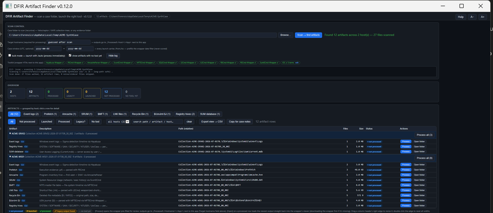

# DFIR Artifact Finder

A single-file **master triage launcher** for Windows DFIR casework. Point it at a case folder (a tree of Velociraptor / KAPE collections, typically one per host); it recursively scans the tree, identifies every artifact the wrapper family can process, and presents a **host-grouped launch board**. One click launches the matching parser-wrapper with the artifact path and output directory pre-filled.

No install, no dependencies, no framework: one `.hta` that runs on any Windows box via the built-in `mshta.exe`.

It never opens or parses artifact contents itself — it is a **scanner + registry + launcher** that drives the wrapper family:

| Artifact | Launches |
|---|---|
| Windows event logs (`.evtx`) | [Hayabusa-Wrapper](https://github.com/bpmorris22/Hayabusa-Wrapper) |
| Prefetch (`.pf`) | [PECmd-Wrapper](https://github.com/bpmorris22/PECmd-Wrapper) |
| `Amcache.hve` | [AmcacheParser-Wrapper](https://github.com/bpmorris22/AmcacheParser-Wrapper) |
| SRUM (`SRUDB.dat`) | [SrumECmd-Wrapper](https://github.com/bpmorris22/SrumECmd-Wrapper) |
| `$MFT` / `$UsnJrnl:$J` (USN journal) | [MFTECmd-Wrapper](https://github.com/bpmorris22/MFTECmd-Wrapper) |
| SQLite databases | [SQLECmd-Wrapper](https://github.com/bpmorris22/SQLECmd-Wrapper) |
| LNK files | [LECmd-Wrapper](https://github.com/bpmorris22/LECmd-Wrapper) |
| Jump lists (Automatic/Custom destinations) | [JLECmd-Wrapper](https://github.com/bpmorris22/JLECmd-Wrapper) |
| Registry hives (SYSTEM/SOFTWARE/SAM/SECURITY/NTUSER/UsrClass) | [RECmd-Wrapper](https://github.com/bpmorris22/RECmd-Wrapper) |
| `$Recycle.Bin` / SUM / WebCache | flagged on the board (no wrapper yet) |



> The board after scanning a two-host case: artifacts grouped per host, type filters, per-row **Process** / **Open folder**, per-host **Process all**. Screenshot uses synthetic data (fabricated hosts `ACME-WS01` / `ACME-SRV02`) — no real case data.

## How it works

1. **Scan** — enumerates the tree with `dir /s /b` (robust on the very long paths Velociraptor/KAPE trees produce, where FSO recursion fails), classifies each file against the artifact catalog, and **groups results by host**.
2. **Launch** — **Process** resolves the matching wrapper `.hta` (next to the finder, or downloads it from GitHub if absent) and launches it via the family CLI contract with the artifact path + output directory pre-populated:
   ```
   mshta.exe "<Tool>-Wrapper.hta" "<artifactPath>" "<outDir>" [/auto]
   ```
   The wrapper opens in its own window so you can review and start processing there. An opt-in **bulk** checkbox adds `/auto` (process immediately) for launch-many sessions — default **off**. **Process all (N)** on a host's header row queues every unprocessed tool-ready artifact of that host with `/auto` — one launch every 3 seconds — so a fresh collection goes from scanned to fully processing in one click.
3. **Skip what's done** — outputs land in `_Processed\<Hostname>\<App>\` **next to this app** (the mandatory **Target hostname** field names the folder — guessed from the scan, overwrite it if wrong; the wrappers use the same layout when run standalone), and an append-only manifest ties runs back to exact artifact paths, so already-processed evidence shows as **done** on the next scan and isn't re-run by accident. **Open** on a processed row loads the newest output straight back into its wrapper — no reprocessing. Old-convention output (`<scanRoot>\_Processed\<Host>_<Artifact>_<stamp>\`) is still recognised, never written.
4. **Processed inventory** — a hosts × tools grid over `_Processed`, shown before any scan: newest output date (file count) per host per tool across all cases. Click a cell to reopen the newest output in its wrapper; `dir` opens the folder. Each cell also carries the tool's own **triage headline** from its newest run — flagged count / max score (red when there are findings, hover for the top hits; Hayabusa shows crit/high counts, SRUM adds MB sent) — and **Copy triage summary** puts a per-host plain-text block on the clipboard for case notes. Wrappers append a `runinfo.json` provenance entry (now including that summary) after every run, so even standalone runs show up bound to their exact source artifact.
5. **Shared IOC list** — a structured editor (open it from the toolkit strip) keeps `IOC.csv` next to this app with **Value / Type / Note / Case** per indicator; hash and IPv4 values are auto-typed, and any legacy `IOC.txt` terms are imported on first edit so nothing is lost. On save the finder flattens the values to `IOC.txt` — one term per line, `#` comments — which every wrapper auto-loads at launch. So the whole engagement is one typed, annotated, case-attributed list, and the wrappers still read the same simple wire format.

## Quick start

1. Put `DFIR-Artifact-Finder.hta` next to the wrapper `.hta` files (or let it download them from GitHub on first use).
2. Double-click it, pick a **scan root** (a case folder or a single `Collection-*` folder), and **Scan**.
3. Review the host-grouped board; click **Process** on an artifact to launch its wrapper, or **Open folder** to jump to it.

## Command line

```
mshta.exe "DFIR-Artifact-Finder.hta" "<scanRoot>" [/scan] [/from:yyyy-MM-dd] [/to:yyyy-MM-dd]
```
- `<scanRoot>` — the case folder to scan (prefilled into the box).
- `/scan` — start scanning immediately.
- `/from:yyyy-MM-dd` `/to:yyyy-MM-dd` — prefills the **Case window** (UTC). It rides on every wrapper launch as `/from:/to:`, prefilling each wrapper's date filter (recorded in the manifest and each wrapper's `runinfo.json`). Never affects scoring.

The last scan root is remembered in a `DFIR-Artifact-Finder.settings.json` sidecar next to the `.hta` (not committed).

## Notes & limitations

- **Windows only** — needs `mshta.exe` (present on every Windows box). The wrappers it launches are their own single-file `.hta` tools.
- **Never opens evidence** — it only lists, registers, and launches; parsing happens inside each wrapper.
- **Velociraptor paths** with URL-encoded `%` (`C%3A`, `%5C`) are handled — launches go through `WScript.Shell.Run` (no `cmd` expansion), and anything written to a batch file is `%`-escaped.
- **Network case folders** (mapped drive / UNC) work; the UTF-8 file reader falls back to ANSI in the restricted zone automatically.
- No case data ships in this repo — runtime state, logs, and the design spec are kept local via `.gitignore`.

## Credits

- Drives the excellent DFIR parsers by [Eric Zimmerman](https://ericzimmerman.github.io/) (PECmd, AmcacheParser, MFTECmd, SrumECmd, SQLECmd) and [Yamato Security's Hayabusa](https://github.com/Yamato-Security/hayabusa) — via the unaffiliated wrapper family listed above. All parsing credit is theirs.

## License

MIT License — Copyright (c) 2026 Ben Morris
